This is the official repository of the Team CICSA for the international final of the WRO2025 season in Panamá.

## Follow us!

| Facebook | YouTube | Instagram |
|---------------|---------------|----------------|
|  |  |  |

## Contents.
**Folders**
- [📁 Models](./models/)
- [📁 Other](./other/)
- [📁 Schemes](./schemes/)
- [📁 Src](./src/)
- [📁 T-photos](./t-photos/)
- [📁 V-photos](./v-photos/)
- [📁 Video](./video/)

**Index**

- [The team](#The-team)
- [The Challenge.](#The-Challenge)
- [Robot Overview](#Robot-Overview)
- [Robot construction guide.](#Robot-construction-guide)
- [Engineering materials](#Engineering-materials)
- [Mobility Management](#Mobility-Management)
- [Power and Sensor Management](#Power-and-Sensor-Management)
- [Obstacle management](#Obstacle-management)
- [Performance videos](#Performance-videos)
- [Digital Engineering Logbook](https://github.com/CICSA-NET/WRO2025-CICSA/blob/main/other/README.md)
- [Final Remarks and future work](#Final-remarks-and-future-work)
- [References](#References)

___
## The team.
====

CICSA WRO 2025 - Future Engineers

Coach **Sergio Iván Hernández Ruiz**

Coach Sergio Iván provides the technical guidance and leadership required to keep Team CICSA on track. With extensive experience in robotics, he helps us navigate complex challenges, refine our designs, and develop solutions that work in competitive and real-world settings.

Sergio Iván has been the director of the CICSA robotics academy since 2015 and has participated in events organized by the WRO since 2019.
***
**Members:**

**Iván Ramón Hernández Gónzalez**, at 21 years old, he studies Electronics Engineering at the Instituto Tecnológico de Nogales. He participated in the WRO regional competition in 2019, obtaining 1st place in the preparatory category in the city of Guadalajara, Jalisco, México. In 2024, he was the coach of the CICSA team that participated in the ChampionShip of Italy, with an outstanding performance. In 2025, he participated as a coach in the Robotics Championship, an event affiliated with the Baja Robotics League, in Tijuana, Baja California, México, obtaining 2nd place in the Zumo Kit educational competitions category.
***
**Sergio Amid Hernández Gónzalez**, at 19 years old, he studies Software Engineering at Kuepa University. He has participated in numerous competitions, including: the 2019 WRO Regional in Guadalajara, Jalisco, México, where he obtained 1st place. In 2024, in the city of Mexicali, Baja California, México, they obtained 1st place in the preparatory category. He was part of the Mexican robotics team that represented Mexico at the ChampionShip in Italy in 2024.
***
**Xiara Gabriela Alcantar Dorame**, she is 19 years old, studies Mechatronics Engineering at the Universidad Tecnológica de Nogales, in 2020 she was part of the CICSA team that would represent CICSA in the regional competition, but the pandemic prevented the event from taking place, for 2025 she will be part of the CICSA representative in the National competition in Rosarito, Baja California, México.

___

[📁 T-photos](./t-photos/)

[Menu](#Contents)

___

## The Challenge.
====

The WRO Future Engineers challenge pushes students to create fully autonomous self driving vehicles. Each robot must:

- Navigate a dynamically randomized track.
- Detect and avoid colored obstacles (green/red blocks).
- Execute a parallel parking maneuver.

Scoring is based on:
- Performance on track.
- Obstacle handling.
- Documentation quality.
- Innovation and engineering rigor.

Objective:
Design and build a mobile robot capable of autonomous navigation using: 
* Image recognition for object detection.
* PID control to maintain a safe distance from obstacles using ultrasonic sensors.
* Communication between Raspberry Pi 5 and ESP32 to divide tasks between heavy processing (vision) and real-time control (motors and sensors).

**Open challenge.**

**Obstacle challenge.**

For more indo visit: [WRO Official Site](https://wro-association.org/)

[Menu](#Contents)
___

## Robot Overview.
====

| Front | Back | Top |
|---------------|---------------|----------------|
| 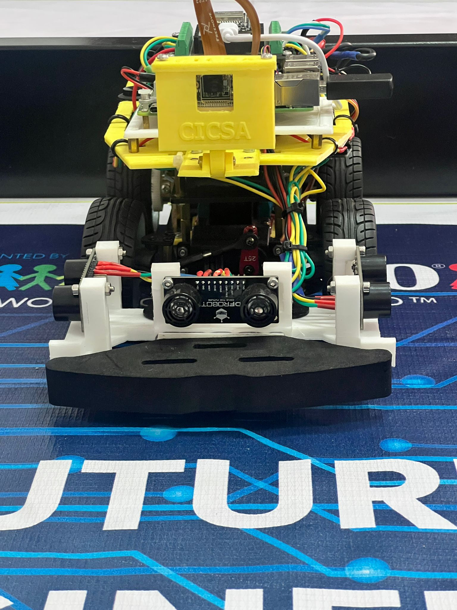 | 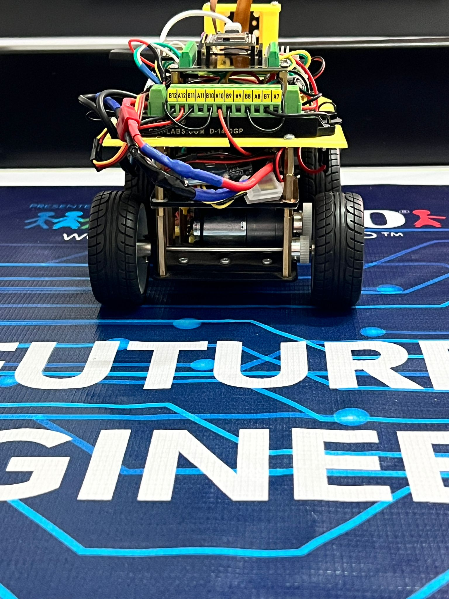 | 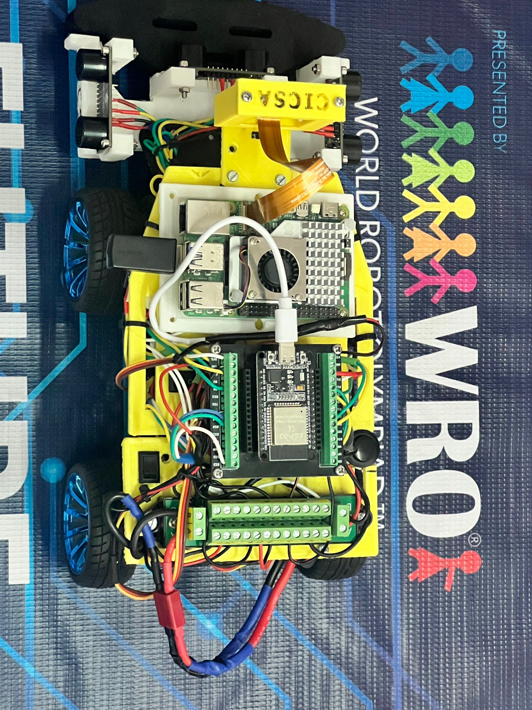 |

| Bottom | Left | Right |
|---------------|---------------|----------------|
| 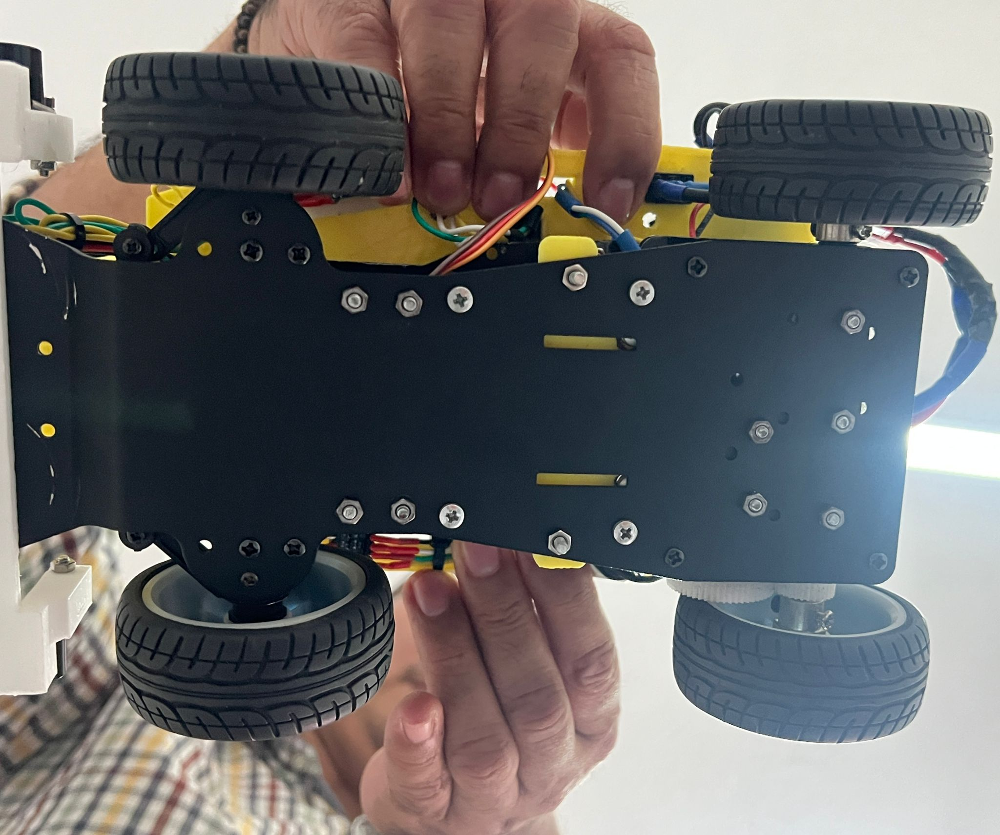 | 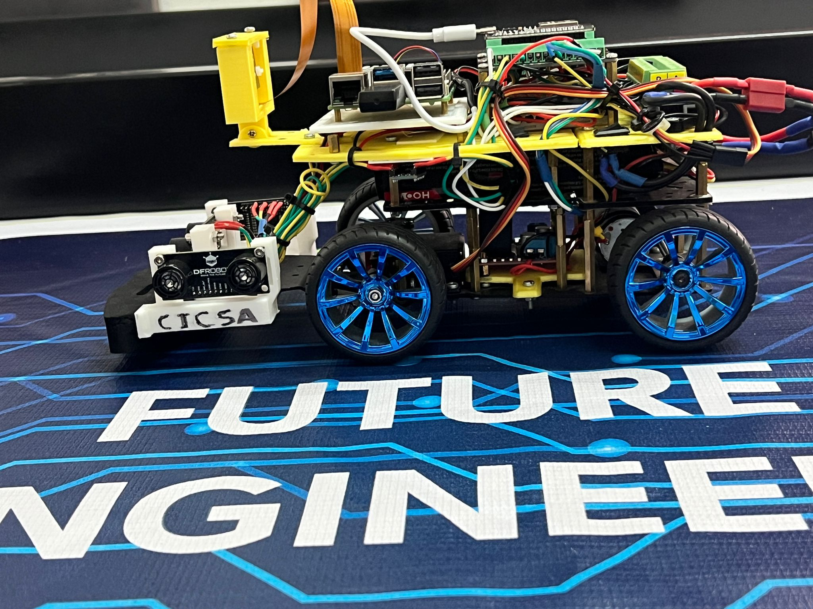 | 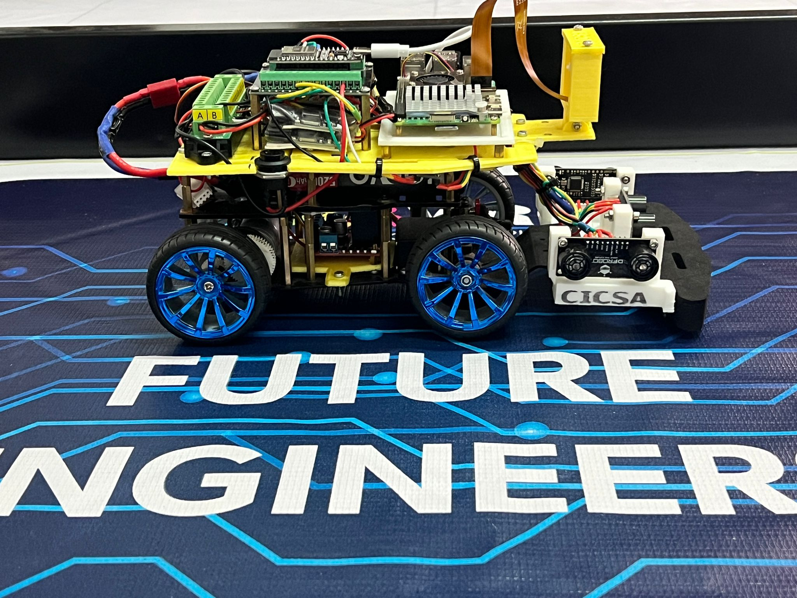 |

| Side Dimensions | Front Dimensions | Robot Weight| 
|---------------|---------------|----------------|
| 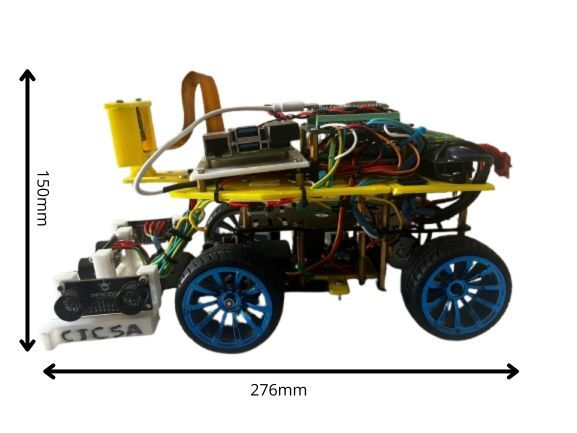 | 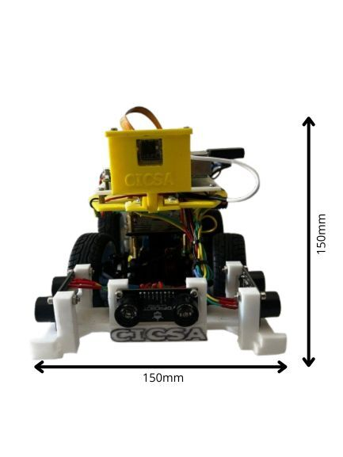 | 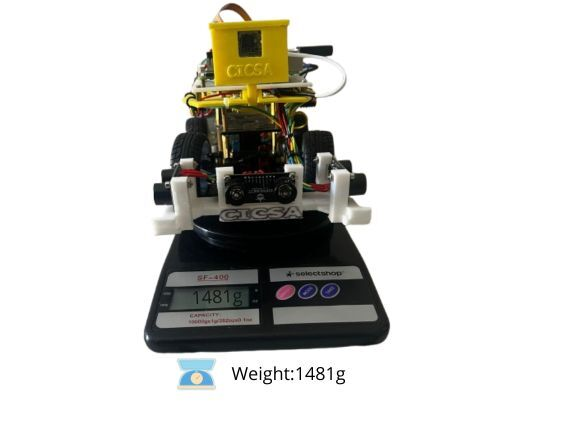 |

| Evolution of the robot |
|---------------|
| 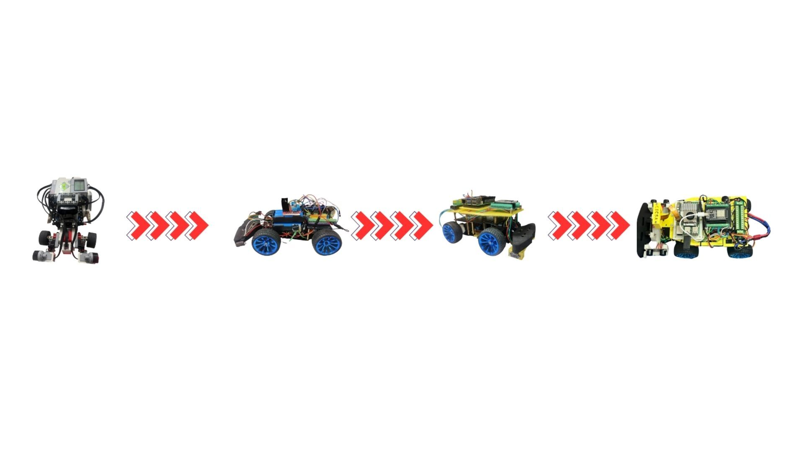 |

[Menu](#Contents)
___

## Robot construction guide.
====

**Assembly Guide.**

This guide provides step-by-step instructions for assembling the robot chassis. It includes mechanical installation, electrical wiring, and safety notes for robotics projects using ESP-32, Raspberry Pi 5, camera and sensors.

---

**Component List.**

| Component                   | Quantity | Description                     |
|----------------------------|----------|---------------------------------|
| JGA25-370 DC Motor         | 1        | Gear motor for drive system     |
| Servo Motor                | 1        | For front steering mechanism    |
| Wheels                     | 4        | Includes M4 nuts                |
| Bearings (large/small)     | 8        | 2 per wheel                     |
| Steering Cup               | 2        | For front wheels                |
| Short Ball Head            | 1        | Connects servo to steering cup |
| Steering Rod               | 2        | Length: 65 mm                   |
| M3×5mm Screws              | 4        | Servo mounting                  |
| M3×8mm Screws              | 4        | Pillar mounting                 |
| M2.5×10mm Screws           | 2        | Steering rod mounting           |
| M3×22mm Copper Pillars     | 4        | Standard chassis height         |
| M3×16mm Copper Pillars     | 4        | Extended front option           |
| Rocker Switch              | 1        | Power control                   |

---

**Pre-Installation Checks.**

**Servo Motor.**
- Connect and calibrate to **90°** before installation.
- Use test code or compatible software.

**DC Motor.**
- Power directly to verify rotation.
- **Red dot** indicates positive terminal.

---

**Wheel Assembly Steps.**

1. Insert rotating shaft.
2. Add large bearing.
3. Install steering cup.
4. Add small bearing.
5. Insert pin.
6. Attach hex coupler.
7. Mount wheel.
8. Secure with M4 nut.

>  Ensure bearings are parallel and wheel rotates freely.

---

**Servo & Steering Assembly.**

- Mount servo to L-bracket using M3×5mm screws.
- Connect short ball head between servo and steering cup.
- Attach steering rods using M2.5×10mm screws.

---

**Chassis Mounting.**

- Use M3×22mm pillars and M3×8mm screws for standard setup.
- For extended front space (e.g. larger battery), use M3×16mm pillars.
- [Place the base to hold the connector](models/base_conector_v3.STL)
- [Place the base to hold the L298N](models/base_l298n.stl)
- [Place the main base](models/base_principal_V6.STL)
- [Place the base to hold the support of the camera](models/base_camera_v2.STL)
- [Place the base to hold the camera](models/base_camera2_V2.STL)
- [Place the camera base cover](models/tapa_camera.STL)
- [Place the base to hold the sensors UM](models/base_urm37_v7.STL)
- [Place the base to hold the Rasoberry Pi 5](models/Base_Pi_5_v5.STL)
- [Place the shield that contains the esp32](https://www.mercadolibre.com.mx/screw-shield-adaptador-de-terminales-esp32-30-pines/p/MLM2038781113?pdp_filters=item_id%3AMLM2162499429#origin%3Dshare%26sid%3Dshare)

For more information regarding 3D printed parts: [📁 Models](./models/)

---

**Electrical Wiring.**

**Servo Motor.**

| Wire Color | Function |
|------------|----------|
| Brown      | GND      |
| Red        | VCC      |
| Yellow     | Signal   |

**Power Switch.**

- Connect **in series** with the positive (red) wire.
- Enables safe power control.

---

**Safety Notes.**

- Do not operate in humid environments.
- Avoid reverse polarity.
- Prevent short circuits.
- Double-check connections before powering on.

---

**Board Compatibility.**

Mounting holes support:

- ESP-32 base
- Camera base
- Raspberry Pi 5 base

---

Original PDF: [Elecrow 4WD Car Installation Instructions](https://www.elecrow.com/download/4wd_CAR_Install_instructions.pdf)

---

[Menu](#Contents)
___

## Engineering materials.
====

This repository contains engineering materials of a self-driven vehicle's model participating in the WRO Future Engineers competition in the season 2025.

| Quantity | Component                        |Link                                                                            |
|----------|----------------------------------|----------------------------------------------------------------------------------------------------------------------------------------------------------------------------------------------------------------------------|
| 1        | Raspberry Pi 5 (16GB)             |[Amazon](https://www.amazon.com/gp/product/B0DSPYPKRG/ref=ox_sc_act_title_6?smid=A02211013Q5HP3OMSZC7W&psc=1)                                                                                                                                                                                                                                            |
| 1        | ESP-WROOM-32                     |[Amazon](https://www.amazon.com/ESP-WROOM-32-Development-Microcontroller-Integrated-Compatible/dp/B08D5ZD528/ref=sr_1_3?crid=4UOP8VE8GTTS&dib=eyJ2IjoiMSJ9.XBINg-sjhfF_gUtnMiKGjjEQQzaaOnS0BOX5B4WtqfKi_hDEOXP7QQezpOTp8e-r5VfFo411y5_IeCcg7DdMeiEcUBSTnC23mXHz1NRbrXP4JVyQShmo1b-y4KGfxRlXgSbH3VJTSz55fBe_QqxKedXkggHhw1Qs7-1O_ErcV1o19Py9to1BKZQxieZLm_8y4zb-6LtXq2DwHFZG0EPFL_AJ_bL6bAtaLzdAk6A-5WPFche0M6tcFhuRjMkOpAN2zYFYcGYeWiFqfLdcRUPoiY2-8jpuuo8vkBUfver4Gk4.mo41uc2rmPqL0XJ5jHK3kmN_x8PFmvrfhMfZ2HkptCM&dib_tag=se&keywords=Esp-Wroom-32&qid=1753387413&s=electronics&sprefix=esp-wroom-32%2Celectronics%2C294&sr=1-3&th=1)                                                                                                                                                                              |
| 1        | Camara Freenove 8MP              |[Amazon](https://www.amazon.com/Freenove-8MP-Raspberry-Adjustable-Viewing/dp/B0BZYPBS17/ref=sr_1_1_sspa?crid=2ZNF0R4SWCQWT&dib=eyJ2IjoiMSJ9.f4-pR4WTqQbw0vioJRPdz0qtF5MiHJl-MhiG_Yo9dxwZXPo4CsqP2Iiyt_ae639ZQ68gVBs98taIG5zMf0PXKR6IMyUoCDn_jD7_hGgcOXlWreSjEqpqQpZTBdGct0sKvzvACoLi4qHOlHhM0e-xMC_308CRUrspoesSuOSSsMM.nVcijt2RJWCE17iYMeWy3e3SG6eqijPvlEt37sYoc44&dib_tag=se&keywords=Freenove%2B8MP%2Bcamera&qid=1753387520&s=electronics&sprefix=freenove%2B8mp%2Bcamera%2Celectronics%2C285&sr=1-1-spons&sp_csd=d2lkZ2V0TmFtZT1zcF9hdGY&th=1)                                                                                                                                                                              |
| 1        | Driver de motor L298N            |[Amazon](https://www.amazon.com/JTAREA-Stepper-Driver-H-Bridge-Mega2560/dp/B0D2RJV2VX/ref=sr_1_2_sspa?crid=3C1LW4P6C7MR1&dib=eyJ2IjoiMSJ9.hK2FjV8Ukp8CCyVTI1seMoTh-okctAQYG9wv8_2wWQicu3tQcZGLcWqQEfZJZiEpCHtA15XAfvFsTRtoXRJ6wEG8xSTcdPfjtlfmyDqol-3C38gVuPnv3FlabrIutV5q3wzdwbimQaUZF726_CESUC5PDSaG-sz7VeI6AP5hrkIpA2wr_m-ZQoxYgSgCYoBXOSU32LgaoI1_3YNdT_o4-caslfve1JPRLD6TIg68hNFwg8Zbz9FSaIh7d_UwKp6OgV7lm5ut-c0lOlitzyWm5AU5nTyhq4AwX1OCGBCl33Y.P4ZzI9RZbRt-hM7EfbWZSR7GTTefFCgTi5MY6UKLEI0&dib_tag=se&keywords=L298N%2Bmotor%2Bdriver&qid=1753387552&s=electronics&sprefix=l298n%2Bmotor%2Bdriver%2Celectronics%2C173&sr=1-2-spons&sp_csd=d2lkZ2V0TmFtZT1zcF9hdGY&th=1)                                                                                                                                                                             |
| 1        | Terminal Block OONO D-1410GP     |[Amazon](https://www.amazon.com/Position-Terminal-Distribution-OONO-D-1410GP/dp/B0DXF1GF9Q/ref=sr_1_1?crid=140OFKMTB914J&dib=eyJ2IjoiMSJ9.oyThY0ippJh2jpcbBoag45_Yy8PEQreSJWIoxRLGJHl0FzLTVwZoc02IwtBHRkfC0I7PYLYIWd6UbsHiUIrN3Pf6J1fmQ0WOdjOywU2Q4btVb0M56DmmQqjH2xy5OAeL.9n0Fz7UoURPFld0OI-_0_POLB5a_Wiq-rjM5o3Va7oI&dib_tag=se&keywords=16Amp%2BAC%2FDC%2B48V%2B2x12%2BPosition%2BTerminal%2BBlock%2BOONO%2BD-1410GP&qid=1753387584&s=electronics&sprefix=16amp%2Bac%2Fdc%2B48v%2B2x12%2Bposition%2Bterminal%2Bblock%2Boono%2Bd-1410gp%2Celectronics%2C157&sr=1-1&th=1)                                                                                                                                                                            |
| 2        | SoloGood 5V 5A (2s/3s/4s)        |[Amazon](https://www.amazon.com/SoloGood-Module-Quadcopter-Airplane-Servo/dp/B0C3GVGYDS/ref=sr_1_1?crid=130PU2TQP9VFF&dib=eyJ2IjoiMSJ9.5ilYenkdfQx0sH7IWq1Dsw.GcriRAsBaQcvL5bQL95L5kTVKu1i9MbWD0VondXRe0M&dib_tag=se&keywords=SoloGood+5V+5A+module+2s+3s+4s&qid=1753387657&s=electronics&sprefix=sologood+5v+5a+module+2s+3s+4s%2Celectronics%2C275&sr=1-1)                               |
| 1        | External UBEC 5V BEC Multi-Purpose Step-down Power Supply Module Full Shielding Antijamming for FPV Airplane (1PC 5V 7A)       |[Amazon](https://www.amazon.com/dp/B0D7MR48LB?ref=ppx_yo2ov_dt_b_fed_asin_title&th=1)                               |
| 1        | Battery LiPo HOOVO 11.1V 3S 5200mAh 60C |[Amazon](https://www.amazon.com/HOOVO-11-1V-5200mAh-Softcase-Helicopter/dp/B0BWJH8G35/ref=sr_1_5?dib=eyJ2IjoiMSJ9.14IXf-IEW8YrQazHQ7fy_SYbRX19Y71vhVqgdLc_roy4_35L7F0517eY81ZP8PpX9AciCIoh2u6e5zViDL7hVdLpJ8hyiYrkcoIWxJ98IlKo82ZmZSACOFQtvBgSoSBZ8n6hxXRP72KHUtvgOP1Cir3AkjlaOk3ZJ9jagfyaJeRrSPA8HATfkxb5CISmEa4NIT98dzTQ4VUvqNvEvi6emUJW4g5I9VzpfQM1JT9MJwxvm3Y0C9B2HdZLFt-wsFTgGRfSCuZWWmdOYNCT_c7N6O5Y3tqUu8EIWLsFjBN5xiU.f-REaxpvTDZb27O-lM1suBBWJ6chVsI-lTcEvrHgPxE&dib_tag=se&keywords=HOOVO%2B11.1V%2B3s%2BLiPo%2BBattery%2B5200mAh%2B60c&qid=1753387686&sr=8-5&th=1)                                                                                                                                                                          |
| 1        | Chasis 4WD + servo S3003 |[Elecrow](https://www.elecrow.com/4wd-smart-car-robot-chassis-for-arduino-servo-steering.html)                                                                                                                             |
| Varios   | Jumper y cables                  |[Amazon](https://www.amazon.com/-/de/dp/B01EV70C78/ref=sr_1_3?__mk_de_DE=%C3%85M%C3%85%C5%BD%C3%95%C3%91&crid=2A54IVO4KIECV&dib=eyJ2IjoiMSJ9.tjHxIQLJsk16_0YVtUGN6dGzV2wHYrdA_LNt2EBckEg2xcbQMpJP-tZhKHEuWRR-MW4OEUzxcuhDJWmZwkqQIS1B8R4KD9VPknZsY7K80ef8j7pG0HtHMmLqeqU7-A3Xsv5YYc2QReX4JbUyhsl0Q5pEnLjNCOn6odp-5DuUfT3mG8HtShQf_jbzv7-HTr3zvCq-5_0rhPXqgLbhG9gjPLVPjci9S5ODpgwZ0-cLdX4.BJ1rVbT8hocV1kpTSv17AsJTxlT80S-MM0gOof1DPbk&dib_tag=se&keywords=raspberry%2Bpi%2Bjumper%2Bwires&qid=1731244240&sprefix=raspberry%2Bpi%2Bjumper%2Bwire%2Caps%2C330&sr=8-3&th=1)|
| 1        | Cable 24 AWG PUDKLE (157ft)      |[Amazon](https://www.amazon.com/dp/B0DK57KRCT?ref=ppx_yo2ov_dt_b_fed_asin_title&th=1)                                                                                                                                                                   |
| 2        | Logic Level Converter Bi-Directional Shifter Module 3.3V to 5V    |[Amazon](https://www.amazon.com/dp/B07CXMDJC2?ref=ppx_yo2ov_dt_b_fed_asin_title)   |
| 1        | Screw shield adaptador ESP-32    |[Mercado Libre](https://articulo.mercadolibre.com.mx/MLM-2162499429-screw-shield-adaptador-de-terminales-esp32-30-pines-_JM#origin%3Dshare%26sid%3Dshare)   |
| 1        | 6pcs DIN Rail Terminal Blocks    |[Amazon](https://www.amazon.com/dp/B0BQ6GWW3T?ref=ppx_yo2ov_dt_b_fed_asin_title&th=1)   
| 3        | Ultrasonic sensors URM37V5.0     |[DigiKey](https://www.digikey.com/en/products/detail/dfrobot/SEN0001/6588449)    |
| 1        | USB to TTL Converter             |[Amazon](https://www.amazon.com/DSD-TECH-SH-U09C5-Converter-Support/dp/B07WX2DSVB/ref=sr_1_1_sspa?crid=2QX262TSU2971&dib=eyJ2IjoiMSJ9.D0amzFmzxb2ADgV4_ep2_cNsHofmse9FrT0i3YgPbkkxw9dDBUytrt0npuovbHnL_3S6v23XzdO_asu_QGvTb2Xjt8cJP9msCvWRym4dC-NQ5NTpSmg1KoBVbtpjXTKzSdeGcnmmJXYL0MKO4YnP0BkdedFIRCeQRcUuI0so7kzy4gRZetXyXEyAKVydX322o3dGYQZDO36bSsJFr7-PYeHAkOIlBLjA0B6oDqn0qCY.4Iuq8Gj72bw3DYdHWGSINCcQwrmvXEQQxcY40qAGySw&dib_tag=se&keywords=uart+to+usb.3v&qid=1754865582&sprefix=uart+to+usb.3%2Caps%2C240&sr=8-1-spons&sp_csd=d2lkZ2V0TmFtZT1zcF9hdGY&psc=1)    |

Estimated total cost ==> **$ 327.00 US dollars**.

|    Component         |   Function / Description                          |
|----------------------|---------------------------------------------------|
| Raspberry Pi 5       | Image processing and navigation logic             |
| ESP32                | Real-time servo control with PID algorithms and read sensors          |
| Camera               | Captures images for computer vision               |
| ARM37V5 (x3)         | Distance measurement for obstacle avoidance       |
| L298N Motor Driver   | Controls DC motors                                |
| DC Motor             | Robot movement                                    |
| Lipo Battery         | Portable power source                             |
| Voltage Regulator    | Stabilizes voltage for sensitive components       |
| UART Communication   | Link between Raspberry Pi and ESP32               |
| 2WD / 4WD Chassis    | Physical structure of the robot                   |
| Servo motor          | Controls steering direction                       | 

Software & Libraries Overview
|    Platform         |   Language / Frameworks          |   Key Functions / Roles                          |
|---------------------|----------------------------------|--------------------------------------------------|
| Raspberry Pi 5      | Python 3                         | Main control logic, image processing             |
|                     | OpenCV                           | Computer vision (line following, object tracking)|
|                     | pyserial                         | UART communication with ESP32                    |
|                     | numpy, imutils                   | Math operations, image transformations           |
| ESP32               | MicroPython                      | Lightweight firmware for real-time control       |
|                     | machine, time, ustruct           | Sensor reading, PWM generation, UART handling    |
|                     | PID function                     | Servo control                                    |

Workflow Table
|    Module           |    Function / Task                                      |
|---------------------|---------------------------------------------------------|
| Raspberry Pi 5      | Captures image via camera                               |
|                     | Processes image using OpenCV (color)                    |
|                     | Determines direction.                                   |
|                     | Sends commands to ESP32 via UART                        |
| ESP32               | Receives commands from Raspberry Pi                     |
|                     | Reads ultrasonic sensor data                            |
|                     | Applies PID control to maintain safe distance           |
|                     | Controls motors and servo using PWM                     |

[Menu](#Contents)
___

## Mobility Management.
====

**Design Objectives**

The mobility system was designed to meet the following goals:

- **Precision**: Achieve controlled movement and accurate steering.
- **Stability**: Maintain balance and traction across varied surfaces.
- **Mechanical Efficiency**: Use gear ratios to optimize torque and speed.
- **Adaptability**: Respond effectively to terrain changes and obstacles.

**Gear Transmission**: Power is delivered from the motors to the wheels through a custom gear system. Gear ratios were selected to enhance torque for low-speed control and obstacle negotiation.

Mobility is a key factor in robotic performance, especially in competitive environments where precision, stability, and adaptability are essential. This document outlines the mechanical and software strategies used to manage the robot's mobility, featuring a gear-based transmission system and directional control via a servomotor.

The gear transmission is a mechanical system that allows for the modification of angular velocity and torque between two connected shafts. This is achieved by coupling two gears: a driving gear (coupled to the motor) and a driven gear (coupled to the load or wheel).

Based on the previous terms, we use them in the robot as follows:

1. For the free challenge, it is required that the robot has more speed than torque, which is why the driven gear has 54 teeth in relation to the driving gear of 32. If we apply the principle of conservation of mechanical power,
  
   where:  RT =   driven gear teeth / driving gear teeth = 54 / 32 = **1.68**

   
2. For the obstacle challenge, it is required that the robot moves slowly and with more torque, resulting in the driven gear for this particular challenge having 32 teeth and the driving gear having 54, so that by applying the principle of conservation of power, a decrease in speed is obtained, but torque increases in the following proportion:

   where:  RT =   driven gear teeth / driving gear teeth = 32 / 54 = **0.59**

The motor is controlled using the pulse width modulation technique. Pulse Width Modulation (PWM) is a widely used technique for controlling the speed of DC motors by adjusting the effective voltage applied to the motor terminals. Instead of varying the actual supply voltage, PWM rapidly switches the motor’s power on and off at a fixed frequency, modulating the duration of the “on” time within each cycle—this is known as the duty cycle. The motor’s speed is directly influenced by the duty cycle of the PWM signal. A higher duty cycle means the motor receives power for a greater portion of each cycle, resulting in a higher average voltage and increased rotational speed. Conversely, a lower duty cycle reduces the average voltage and slows the motor down. The configuration parameters are shown below:

**These are the parameters defined for the open-category challenge:**

enable = PWM(Pin(21), freq=1000)        # Motor PWM enable

enable.duty_u16(35000)                  # Set duty cycle to ~53.4%

- Pin(21): Refers to GPIO pin 21 on the microcontroller (ESP32). This pin is physically connected to the motor driver’s (L298N) enable input, which expects a PWM signal.
- PWM(...): Initializes a PWM object on that pin.
- freq=1000: Sets the PWM frequency to 1000 Hz (1 kHz), meaning the signal completes 1000 cycles per second.
- duty_u16(...): Sets the duty cycle using a 16-bit value (range: 0 to 65535).
- 35000: Represents the “on” time of the PWM signal. The duty cycle percentage is:
  Duty Cycle(%) = (35000 / 65535) * 100                **approx 53.4\%**
- This means the signal is high (ON) for 53.4%.
- Average Voltage: The motor receives approximately 53.4% of the supply voltage. If V = 11.1 V, then:
  V = 11.1V * 0.534      **approx 6V**

Based on the measured values and the technical specifications provided by the manufacturer, the following results are obtained:

| Parameter             | Measured Value | Unit       |
|----------------------|----------------|------------|
| No-load Speed         | 646            | RPM        |
| No-load Current       | 0.1            | A          |
| Rated Torque          | 0.23           | Kg-cm      |
| Power                 | 1.5            | W          |
| Load Speed            | 516            | RPM        |
| Load Current          | 0.8            |  A         |
| Stall Torque          | 2              | Kg-cm      |
| Stall Current         | 2              | A          |
| Operating Voltage     | 6.0            | V          |

[Reference](https://www.elecrow.com/4wd-smart-car-robot-chassis-for-arduino-servo-steering.html)

**The following parameters were defined for the obstacle challenge:**

- 26000: Represents the “on” time of the PWM signal. The duty cycle percentage is:
  Duty Cycle(%) = (26000 / 65535) * 100                **approx 39.6\%**
- This means the signal is high (ON) for 39.6%.
- Average Voltage: The motor receives approximately 39.6% of the supply voltage. If V = 11.1 V, then:
  V = 11.1V * 0.396      **approx 4.39V**

Based on the measured values and the technical specifications provided by the manufacturer, the following results are obtained:

| Parameter             | Measured Value | Unit       |
|----------------------|----------------|------------|
| No-load Speed         | 472            | RPM        |
| No-load Current       | 0.073          | A          |
| Rated Torque          | 0.263          | Kg-cm      |
| Power                 | 1.0            | W          |
| Load Speed            | 377            | RPM        |
| Load Current          | 0.58           |  A         |
| Stall Torque          | 2              | Kg-cm      |
| Stall Current         | 1.46           | A          |
| Operating Voltage     | 4.39           | V          |

[Reference](https://www.elecrow.com/4wd-smart-car-robot-chassis-for-arduino-servo-steering.html)

**Directional Control**: A high-precision servomotor is used to steer the front axle, allowing for smooth and responsive turns. This setup mimics real-world vehicle steering and improves maneuverability in tight spaces.

The foundation of our chassis design is based on a steering configuration known as the parallel steering model, in which both front wheels turn at the same angle when steering input is applied. This approach, while mechanically straightforward, provides a reliable baseline for mobile robot steering systems—especially when simplicity, symmetry, and ease of implementation are key priorities.

In short, parallel steering was chosen because it strikes a balance between functionality and feasibility. It enables reliable performance while keeping the mechanical and computational demands accessible—perfect for STEM education, prototyping, and early-stage competition builds.

The selection was based mainly on the following reasons:

1. Mechanical Simplicity
- The parallel steering model allows both front wheels to turn at the same angle using a single servo or mirrored linkage system.
- This reduces the number of moving parts and avoids the need for complex geometry or differential steering mechanisms.
2. Ease of Control
- From a programming standpoint, controlling a single angle for both wheels is straightforward.
- It simplifies PID tuning, sensor feedback loops, and integration with basic autonomous navigation systems.
3. Modular Compatibility
- Many commercial chassis kits (like those using MG996R servos or JGA25-370 motors) are designed with parallel steering in mind.
- This makes it easier to integrate with off-the-shelf components and adapt to different platforms.
4. Symmetry and Predictability
- Parallel steering provides predictable turning behavior, which is useful for line-following, maze-solving, or path planning in competition environments.
- It also simplifies documentation, calibration, and debugging.

**Dimensions, Steering Geometry, and Their Impact on Navigation**
The robot designed for the Future Engineers category of the WRO has dimensions of 150 mm in width, 150 mm in height, and 276 mm in length, with a total weight of 1480 grams. These specifications fall within the official limits defined by the competition rules.

**Parallel Steering Geometry with 35° Angles**. 
The robot uses a parallel steering geometry, meaning both front wheels turn at the same angle. In this case, the steering angle is 35 degrees, which provides a reasonable turning capability for wide trajectories. This system is mechanically simple and symmetrical, making it ideal for implementation with servos and direct control.

**Turning Ability and Adjustments in the Open Challenge.**
The 276 mm length results in a larger turning radius, especially in confined spaces. While the 35° steering angle allows functional turns, perfect for use with PID control algorithms.

**Obstacle Avoidance in the Obstacle Challenge.**
The 150×276 mm footprint defines the robot’s contact area with the ground, presenting the following advantages:
-  	Stable base for sensor mounting: The extended length allows for strategic placement of ultrasonic sensors at the front and side, improving obstacle detection and path planning.
-  	Improved traction and weight balance: The 1480 g mass provides sufficient downward force for consistent wheel contact, reducing slippage on ramps or uneven surfaces.
-  	Predictable movement dynamics: The rectangular footprint and parallel steering geometry result in symmetrical turning behavior, which simplifies obstacle avoidance algorithms and makes path corrections more consistent.
-  	Room for modular attachments: The chassis accommodates additional modules such as grippers, cameras, or sensor arrays without compromising structural integrity.
-  	Low center of gravity potential: With proper component placement, the 150 mm height allows for a compact vertical profile, minimizing the risk of tipping during lateral movements or sudden stops.

**Motor and Servo Specifications**

| Parameter         | JGA25-370 Gear Motor (12V)           | MG996 Servo Motor (6V)             |
|------------------|--------------------------------------|------------------------------------|
| **Operating Voltage** | 6V / 12V / 24V DC                    | 4.8V – 6V DC                        |
| **No-Load Speed**     | 12 – 1350 rpm (depends on gear ratio) | 0.14 s/60° (≈ 428°/s)              |
| **Rated Speed**       | 9 – 1000 rpm                        | Controlled via PWM (0°–180°)       |
| **Stall Torque**      | Up to 9 kg·cm (gear ratio dependent) | 11 kg·cm                            |
| **Rated Torque**      | 0.6 – 9 kg·cm                        | ~2.5 – 9.4 kg·cm (typical range)   |
| **Power Output**      | 1.6W – 3W                            | ~2.5W (estimated)                  |
| **Current Draw**      | ≤0.25A rated / ≤3A stall             | ~500mA running / 2.5A stall        |
| **Rotation Range**    | Continuous                          | 0° to 180°                         |
| **Control Method**    | PWM + gear ratio                    | PWM signal (50Hz, 1–2ms pulse)     |

**JGA25-370 Motor Specifications by Voltage**

| Voltage (V) | No-load Speed (rpm) | Rated Torque (kg·cm) | Power (W) | Load Speed (rpm) | Load Current (A) | Stall Torque (kg·cm) |
|-------------|----------------------|------------------------|-----------|-------------------|-------------------|------------------------|
| 3V          | 323                  | 0.18                   | 0.75      | 258               | 0.4               | 1.4                    |
| 6V          | 646                  | 0.23                   | 1.5       | 516               | 0.8               | 2.0                    |
| 12V         | 592                  | 0.23                   | 2.3       | 475               | 0.6               | 2.0                    |
| 24V         | 409                  | 0.15                   | 1.0       | 347               | 0.5               | 1.3                    |

>  **Technical Notes**:
> - Best performance observed at **12V**, offering solid torque and peak power.
> - Stall torque values are useful for defining load limits and implementing software protection.
> - Ideal for traction, drive systems, or actuator applications with PWM control.

**Chassis Adaptation and Structural Enhancements**: 

A commercial chassis kit was initially acquired as the mechanical foundation for the robot. However, significant structural and functional improvements were implemented to optimize device integration and system stability.
Custom mounting platforms were designed and fabricated to securely accommodate key components such as the ESP32 microcontroller, the Raspberry Pi 5 single-board computer, the camera module, and the sensor array. These modifications involved redesigning the original base plates to ensure precise alignment, vibration damping, and thermal clearance for high-performance operation.
The updated design also includes reinforced brackets and modular supports that facilitate rapid maintenance and component replacement during competition. These enhancements substantially diverge from the original kit layout, resulting in a more robust, competition-ready architecture.
The following technical drawings illustrate the custom adaptations made to the chassis, highlighting the engineering rationale behind each modification and its impact on system performance. The most critical structural adaptations are presented below. These modifications were implemented to enhance component stability, optimize spatial distribution, and improve overall system integration.
Full CAD models and detailed design files can be found in the  folder, including all custom mounts, sensor brackets, and revised base plates. These designs reflect substantial changes to the original kit configuration, tailored to meet the specific demands of the obstacle and open-category challenges.

**Sensors base.**   
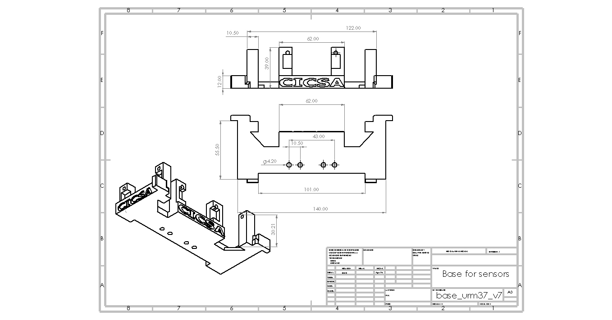

**Camera base.**
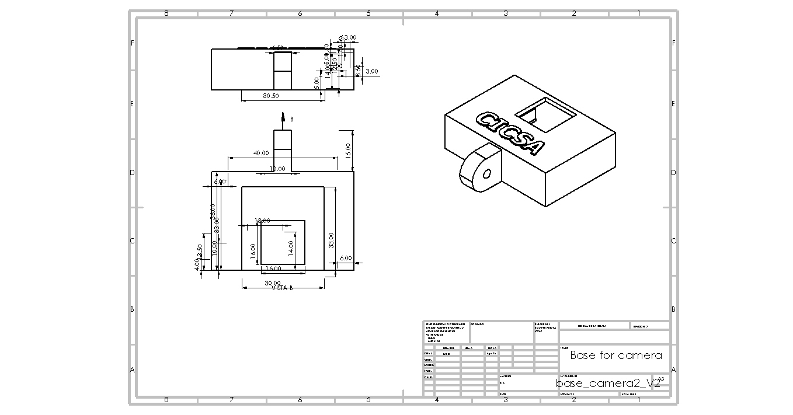
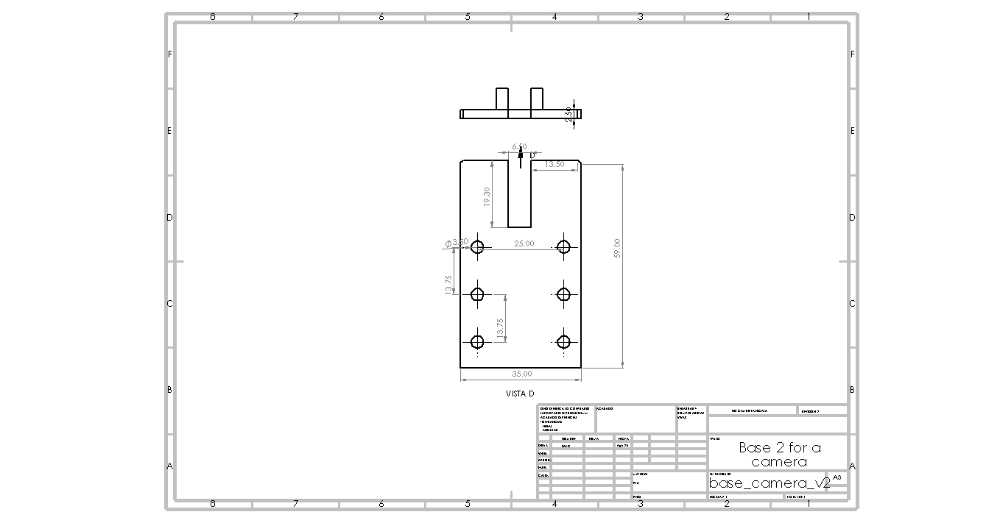
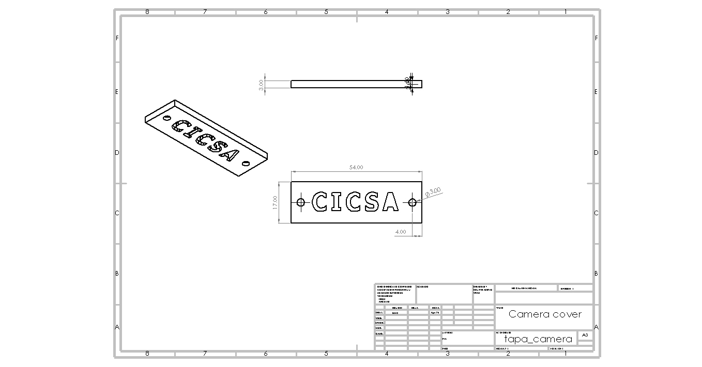

**Main base.**
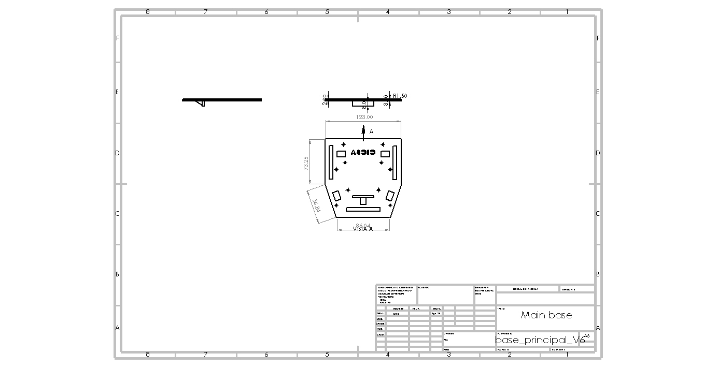

These adaptations ensure modularity, scalability, and ease of maintenance during competition and development phases.

A commercial chassis was selected to optimize structural integrity, motor compatibility, and sensor placement for the mobile robot platform. Below are its key specifications:

| Feature                  | Specification                          |
|--------------------------|----------------------------------------|
| **Material**             | Metal chassis / ABS plastic           |
| **Dimensions (L×W×H)**   | 248 mm × 146 mm × 70 mm                |
| **Wheel Type**           | 2WD with rubber tires (65 mm diameter) |
| **Motor Mounts**         | Compatible with JGA25-370 gear motors  |
| **Servo Mounts**         | Integrated brackets for MG996 servo    |
| **Sensor Slots**         | Front and side slots for ultrasonic sensors |
| **Battery Compartment**  | Supports 2S/3S Battery LiPo HOOVO 11.1V 3S 5200m    |
| **Weight Capacity**      | ~1.5 kg payload                        |
| **Shock Absorption**     | Rubber dampers included                |

**Software Integration**

- **Motor Control**: PWM signals regulate motor speed, while gear ratios provide mechanical tuning. The servomotor is controlled via angle commands for directional adjustments.
- **Error Handling**: The system includes routines to detect gear misalignment, servo overload, or terrain anomalies, triggering corrective actions when needed.

The complete code and description of this can be found at:  [📁 Src](./src/)

**Interaction of the PID control algorithm with the robot.**

A discrete PID control algorithm was designed and implemented, whose output is responsible for controlling the direction of the robot, through the steering system described above. Establishing a reference of 250 mm to a wall laterally, that is, the main task of the controller is to keep the robot at a distance of 250 mm from the wall. The figure shows the closed-loop control system in the Z domain. R(Z) is the system reference, in this case it has a value of 250 mm, E(Z) represents the system error, which is calculated with the measurement of the ultrasonic sensor minus the input reference, D(Z) is the PID control algorithm, U(Z) is the control action output of the controller, G(Z) is the plant, Y(Z) represents the system output. 

The process to be controlled is called plant G(Z), which can represent any physical process whose response must be through an appropriate control action, by satisfactory response it is defined that the output Y(Z), is forced to follow the input reference R(Z), despite the presence of disturbances. The process of keeping Y(Z) close to R(Z), is called the regulation process. The microcontroller uses clock signals in order to synchronize the flow of information, all the time that the microcontroller invests in reading the response of the plant, processing the information and writing the control action, is known as sampling time T. The control action consists fundamentally in calculating the control signal U(Z), see next equation [1]:

Developing equation 01, the result is equation 02, which is finally the control action of the PID algorithm to be implemented.

The reference distance established for the system is 250 mm, which is the distance the robot must maintain in relation to the wall. Table below shows the parameters with which we performed the tests, in order to obtain a point at which the PID controller operates as optimally as possible. The parameters were tuned to the point that most quickly obtained the desired reference and was most stable. It should be noted that this procedure was performed using the tuning method.

Resulting in the most optimal values ​​for the robot:
**Kp = 1.4, Ki = 0.01,  Kd = 0.25 and T=0.15 seg.**

**Performance Evaluation**

Mobility was tested under various conditions:

- **Obstacle Navigation**: The robot demonstrated reliable steering and movement over uneven surfaces and around barriers.
- **Turning Radius**: The servomotor-based steering allowed for tighter turns compared to differential drive systems.
- **Load Testing**: Gear ratios and servo torque were validated under different payloads to ensure consistent performance.
- **Energy Efficiency**: Power consumption was monitored to balance torque output, steering precision, and battery endurance

---

>  **Design Rationale**:
> - Chosen for its modularity and ease of integration with ESP32 and Raspberry 5.
> - Provides stable base for F1-style mobility and sensor calibration.
> - Lightweight yet durable, ideal for competition and field testing.
>

**Engineering Principles Applied**

The design and implementation are grounded in core engineering concepts:

- **Angular velocity**: Used to calculate linear displacement from motor rpm.
- **Torque**: Determines traction force and load capacity.
- **Power**: Guides battery selection and motor efficiency.
- **Mass distribution**: Ensures stability and maneuverability.

**3D Printed Components**

Complementary 3D-printed parts used to enhance the commercial chassis are included in the `models/` folder located at the top level of this repository.

These components include:
- **Sensor mounts** (ultrasonic)
- **Battery holders**
- **Structural reinforcements** and expansion adapters

>  All files are provided in `.STL` format and are ready for slicing and printing. Designed for compatibility with standard FDM printers and PLA materials.

[Menu](#Contents)
___

## Power and Sensor Management.
====

Efficient energy and sensor management are essential for reliable vehicle performance. This section outlines the power strategy, sensor selection, and system integration used in the robot.
Three sensors were used to provide the microcontroller (ESP32) with the necessary information to navigate the track and overcome various challenges. One sensor is mounted on the right side of the vehicle to work in conjunction with the PID controller, maintaining a specific distance from the wall. Another sensor is placed on the left side, performing the same function on the opposite side. A third sensor is positioned facing forward to monitor when the robot approaches the front wall.

**Pinout of the main components.**
| ESP-32 | Raspberry PI 5 | URM37 |
|---------------|---------------|----------------|
| 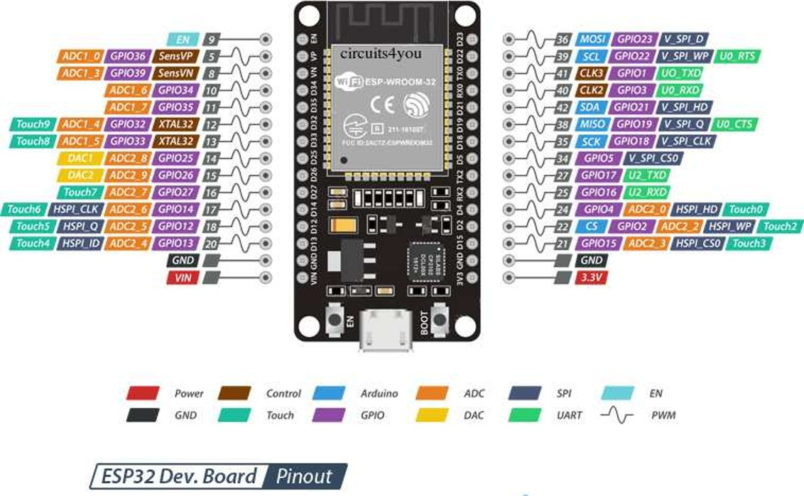 |  |  |

**Main connection diagram.**
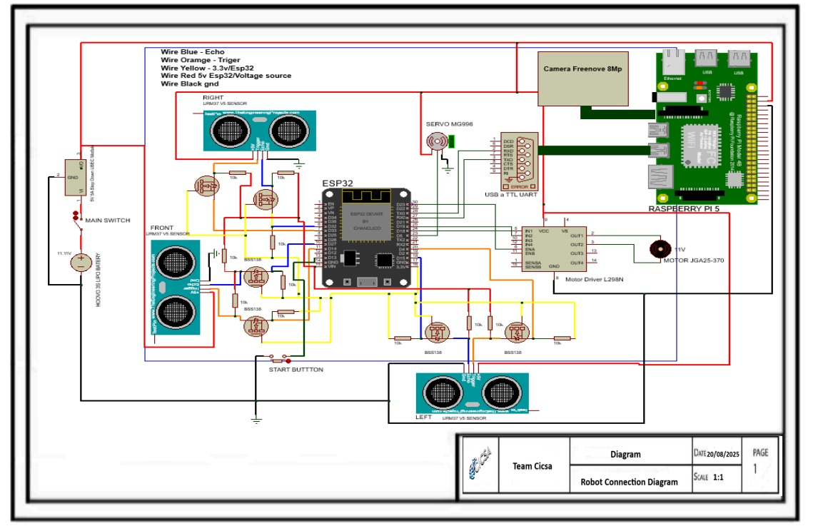

**Current Consumption Analysis – Robotic System**

| Component               | Quantity | Voltage (V) | Current per unit (A) | Total current (A) | Max total current (A) |
|------------------------|----------|-------------|-----------------------|--------------------|------------------------|
| JGA25-370 Motor        | 1        | 11          | 0.6                   | 0.6                | 0.6                    |
| MG996R Servo           | 1        | 5.0         | 0.5                   | 0.5                | 1.0                    |
| Raspberry Pi 5         | 1        | 5           | 1.2                   | 1.2                | 3.5                    |
| ESP32                  | 1        | 5           | 0.08                  | 0.08               | 0.08                   |
| URM37V5 Sensor         | 3        | 5           | 0.02                  | 0.06               | 0.06                   |
| L298N (logic circuit)  | 1        | 5           | 0.05                  | 0.05               | 0.05                   |
| **Estimated Total**    | —        | —           | —                     |👉 **2.49 A**       | 5.29 A                 |

**Power Supply Strategy**

The power system is designed to support motors, servos, microcontrollers, and sensors simultaneously. Key considerations includes two challenges, each powered by a different voltage source.
For the open challenge and the obstacle challenge, the system is powered by a battery that supplies 5200 mA.
Detailed battery specifications are provided below

- **Battery type**  
  - Battery LiPo HOOVO 11.1V 3S 5200mAh 60C

- **Power regulation**  
  - Buck converters or dedicated power rails to prevent voltage drops and protect sensitive components

**Sensor Selection and Justification**
Three ultrasonic sensors [URM37 V5.0](https://wiki.dfrobot.com/URM37_V5.0_Ultrasonic_Sensor_SKU_SEN0001_) were selected to provide the robot with positioning information on the track.
They were mounted on the front of the robot: one on the right side, one on the left side, and one in the center.
This configuration allows the robot to detect lateral boundaries and maintain alignment during navigation.

The side mounted sensors provide the system with distance measurements between the robot and the lateral walls.
A PID control algorithm was implemented to maintain a consistent, predefined distance from these walls during navigation.
The center sensor supplies data regarding the robot’s proximity to the front wall, enabling forward obstacle detection and alignment.
Each sensor contributes to navigation, obstacle detection, or environmental awareness:

| Sensor       | Purpose                     | Protocol | Power Notes         |
|--------------|-----------------------------|----------|----------------------|
| 3 URM37V5.0    | Distance measurement        | Digital  | Low consumption      |

**Specification:**
- Operating voltage: 3.3V ~ 5.5V.
- Operating current: 20 mA.
- Working temperature: -10°C ~ 70°C.
- Detecting range: 2cm - 800cm (ultimate range 1000cm).
- Resolution: 1cm.
- Accuracy:1%.
- Measuring period: <100ms (Max).
- Dimmensions: 22mm X 51mm.
- Weight: about 25g.

Technical Discussion: **Justification for the Frontal Triangular Sensor Layout.**
This frontal sensor configuration was selected to optimize obstacle detection, corner recognition, and real-time control feedback. The measurements obtained from the side-mounted sensors serve as inputs for calculating the error relative to a reference in the PID control algorithm. The layout provides a wide horizontal sensing field while maintaining directional specificity:
- Left Sensor: Detects lateral obstacles and corner proximity on the robot’s left flank. It is essential for initiating left turns and feeds distance data into the PID control algorithm.
- Center Sensor: Functions as the primary forward-facing detector. It monitors frontal clearance, triggers corner detection based on threshold distance, and supports collision avoidance logic. It also serves as a reference for the PID controller, indicating when the robot approaches a frontal wall and needs to initiate a turn.
- Right Sensor: Mirrors the role of the left sensor, enabling symmetric detection on the robot’s right flank. It supports right turns and contributes to PID error calculation for wall-following and lane-change decisions.
This triangular arrangement allows the robot to:
- Disambiguate corners from flat walls by comparing differential readings across the three sensors.
- Reduce decision latency by placing all sensors on the frontal plane, ensuring immediate access to environmental data aligned with the robot’s forward motion vector.
- Enhance control precision by providing real-time feedback to the PID algorithm, enabling smoother navigation and more reliable maneuver execution.
By aligning sensor placement with the robot’s direction of travel and control logic, this design ensures that all critical navigation decisions are based on immediate frontal context—improving responsiveness, stability, and overall system robustness.

**Vision System Integration** Freenove 8MP Camera Module.
We integrated the Freenove 8MP Camera Module to enable real time visual sensing, environmental awareness, and documentation capabilities. This section outlines the technical rationale, integration strategy, and performance considerations of the camera within our system architecture.

1. Engineering Justification.
- Sensor Type: 8MP CMOS sensor with support for 1080p and 720p output, suitable for both high-resolution capture and low-latency streaming.
- Field of View: 120° wide-angle lens enables broad environmental coverage, critical for tasks involving navigation, object detection, or visual inspection.
- Interface: CSI ribbon cable connection ensures high-speed data transfer with minimal latency, directly compatible with Raspberry Pi 5.

2. System Level Integration.
- Power Budgeting: Camera draws power via CSI interface; no additional GPIO or external regulators required, simplifying the power distribution model.
- Mechanical Design: Mounted on a custom 3D printed bracket aligned with the robot’s frontal axis, ensuring consistent field of view during motion.

3. Software Configuration.
- Capture Modes: Configured for both still () and video () modes, with resolution switching based on task demands.
- Processing Pipeline: Integrated with OpenCV for real time image processing, including color segmentation, contour detection, and basic object classification.
- Frame Rate Optimization: Tuned to 30 FPS for responsive feedback while maintaining CPU headroom for concurrent tasks.

4. Applications in Future Engineers Context.
- Visual Feedback for Actuation: Enables closed loop control based on visual cues (e.g., line following, color based sorting).
- Environmental Monitoring: Supports detection of objects, terrain features, or visual markers relevant to the engineering challenge.
- Project Documentation: Used to capture high-quality images and video for technical reports, GitHub logs, and sponsor presentations.

5. Limitations and Engineering Tradeoffs.
- Lighting Sensitivity: No onboard IR filter or illumination; external LED modules recommended for low light environments.
- Fixed Focus Lens: Depth estimation requires stereo vision or auxiliary sensors (e.g., ultrasonic or ToF).
- Bandwidth Constraints: High-resolution streaming may impact CPU load; offloading via hardware acceleration or resolution scaling is advised

The camera was mounted at the front of the robot, with an inclination angle of approximately 20 degrees. This positioning allows the camera to capture a forward facing field of view that includes both near ground elements and mid range obstacles. While the tilt angle contributes to the perspective of the captured image, it is not a critical factor for the implemented algorithm. The vision system is designed to process frames using region of interest cropping and perspective normalization, which minimizes the impact of camera orientation. As a result, the algorithm remains robust across slight variations in tilt, ensuring consistent performance in tasks such as line detection, object recognition, or path planning.

**System Integration Overview**

A wiring diagram and bill of materials (BOM) will be included to illustrate:

- Power distribution across all components.
- Voltage regulation.
- Microcontroller pin mapping.
- Sensor interconnections and shielding.

[Menu](#Contents)
___

## Obstacle management.
====

**Perception on Raspberry Pi 5.**

File: [📁 src](src/main_16-09-25_V2.2.0.py)

For each frame, the Pi 5 captures with Picamera2 (low-latency “preview” pipeline), then applies a horizontal Region of Interest (ROI) to reduce false positives and CPU load. The ROI is converted BGR→HSV and thresholded into color masks for red (two hue bands to cover 0/179 wrap-around) and green (one band). A 5×5 morphological opening removes speckle noise. We then extract external contours per color, keep the largest blob for each, and compute its area. Two gates are used:

MIN_CONTOUR_AREA (rejects tiny blobs/noise),

CRITICAL_CONTOUR_AREA (marks an object as immediate).
The decision layer compares red vs. green critical areas and emits a single intent byte over UART (115200): 'R' (right), 'G' (left), or 'C' (continue). The HSV design decouples color from illumination, making thresholds stable in gym lighting; ROI keeps the algorithm fast and focused.

How vision is mixed with distance sensors (ESP32 sensor fusion)
File: controller/main.py

The camera does not command turns directly; it provides intention. The ESP32 fuses that intent with ultrasonic distances (left/right/front) inside a small state machine:

Wall-follow (PID) — default when cmd=='C' and front is clear: a PID loop (REF distance, tunable KP/KI/KD, sample time DT) adjusts the steering servo while motors run at base velocity.

Lane change — when cmd ∈ {R,G} and front is clear: apply a short speed boost, steer diagonally toward the commanded side, enforce a minimum hold time, and require a lateral distance delta (e.g., ≥9 cm) to confirm success; if the delta is not reached before a safety timeout, abort with counter-steer + short recovery and return to PID (integrator/derivative reset).

Corner / frontal obstacle — if front ≤ threshold for N consecutive samples (debounced), run a timed corner-turn routine (reverse+turn, counter-turn, recovery) and then resume PID.

Stuck vehicle detection, collision detection, and error recovery

Stuck detection (any of):
a) Kinematic timeout during lane change (no lateral delta before MAX_DURATION).
b) Sensor stagnation: left/right/front variance < ε for X cycles (robot pushing against something).
c) Optional IMU/encoders: no yaw/odometry change under drive (if available).

Collision detection: hard stop when front ≤ col_thresh, brief reverse, re-evaluate distances. Sudden lateral drop while steering hard can also trigger speed reduction and recentre.

Recovery sequence (bounded): stop → short reverse with opposite steer → check distances → short forward recovery → resume PID. If the lane-change failed, flip intended side (R↔G) once to avoid dead-locks. All recovery paths have timeouts and return deterministically to PID.

Non-trivial combinations of traffic signs

Critical-area priority + temporal hysteresis: we accept a color decision only if it exceeds the critical area and persists for M-of-N frames, which rejects distant/flickering signs.

Ties: if both colors are critical in the same window, apply a deterministic tie-break; if not critical, keep 'C'.

Safety override: a front-obstacle condition always overrides 'R'/'G'; we first handle the corner/obstacle, then resume intent processing.

Calibration notes: green can be light/pale; lower Smin/Vmin for green (HSV) if needed; use narrower H ranges or higher S/V minima to suppress false positives.

Reproducibility & tunables

Vision thresholds: HSV ranges (especially Smin/Vmin), ROI bounds, MIN_CONTOUR_AREA, CRITICAL_CONTOUR_AREA.

Control: PID gains (KP/KI/KD), sampling DT, base velocity, lane-change durations (hold/timeout), corner thresholds/debounce.

All constants are grouped near the top of each file and documented inline for on-site calibration.

**Vision & Control Parameter Table.**

| Parameter                        | Location (file)              | Safe Min       | Safe Max       | Notes                                                                 | Primary Impact             |
|----------------------------------|------------------------------|----------------|----------------|-----------------------------------------------------------------------|----------------------------|
| HSV red band 1 (min H,S,V)       | vision/WRO_headless.py       | (0,110,80)     | (6,160,120)    | Lower S/V widens detection in dim light; avoid whites/orange          | Detection sensitivity      |
| HSV red band 1 (max H,S,V)       | vision/WRO_headless.py       | (8,240,240)    | (14,255,255)   | Tighten H upper bound if orange/yellow leaks                          | False positive control     |
| HSV red band 2 (min H,S,V)       | vision/WRO_headless.py       | (166,110,80)   | (172,160,120)  | Covers hue wrap-around near 179; keep S/V above noise floor           | Detection sensitivity      |
| HSV red band 2 (max H,S,V)       | vision/WRO_headless.py       | (176,240,240)  | (179,255,255)  | High S/V helps avoid glare-driven false reds                          | False positive control     |
| HSV green (min H,S,V)            | vision/WRO_headless.py       | (38,55,60)     | (46,110,90)    | Lower S/V for pale greens; increase if picking up lime/yellow floor   | Detect pale green          |
| HSV green (max H,S,V)            | vision/WRO_headless.py       | (75,240,240)   | (90,255,255)   | Narrow H to suppress yellow; keep S/V high to ignore white glare      | False positive control     |
| ROI x_start (px)                 | vision/WRO_headless.py       | 20             | 120            | Start further from left edge to avoid side clutter                    | Latency & noise            |
| ROI x_end (px)                   | vision/WRO_headless.py       | 560            | 640            | Keep pillars centered; avoid extreme edges                            | Latency & noise            |
| MIN_CONTOUR_AREA (px)           | vision/WRO_headless.py       | 350            | 900            | Higher suppresses speckles; too high may miss distant pillars         | Noise / miss tradeoff      |
| CRITICAL_CONTOUR_AREA (px)      | vision/WRO_headless.py       | 4200           | 7000           | Higher acts later (safer), lower acts earlier (aggressive)            | Action timing              |
| Morph kernel (opening, px)       | vision/WRO_headless.py       | 3              | 7              | 3 preserves faint blobs; 7 cleans heavy noise                         | Noise / detail tradeoff    |
| UART baud (Pi→ESP32)             | vision/WRO_headless.py       | 57600          | 230400         | Use higher only if framing is stable                                  | Latency / reliability      |
| PID KP                           | controller/main_16-09.py     | 1.8            | 3.6            | Lower if oscillation; higher if sluggish                              | Wall-follow stability      |
| PID KI                           | controller/main_16-09.py     | 0.00           | 0.04           | Integrates bias; too high = drift after turns                         | Steady-state error         |
| PID KD                           | controller/main_16-09.py     | 0.15           | 0.45           | Damps oscillations; too high amplifies noise                          | Overshoot damping          |
| PID DT (s)                       | controller/main_16-09.py     | 0.02           | 0.04           | Match loop cadence and sensor update rate                             | Controller timing          |
| Base velocity (PWM units)        | controller/main_16-09.py     | 24000          | 28500          | Higher speed reduces margin; test with front threshold                | Speed vs stability         |
| Boost (ΔPWM)                     | controller/main_16-09.py     | 800            | 1600           | Too high can skid on lane change                                      | Lane-change success        |
| Lane min hold (ms)              | controller/main_16-09.py     | 150            | 260            | Guarantees diagonal onset before checking Δ                           | Reliability                |
| Lateral delta success (cm)       | controller/main_16-09.py     | 7              | 12             | Distance change required on relevant side                             | Success criterion          |
| Lane-change timeout (ms)         | controller/main_16-09.py     | 600            | 1000           | Abort if Δ not achieved; triggers recovery                            | Stuck detection            |
| Corner front threshold (cm)      | controller/main_16-09.py     | 18             | 28             | Higher = earlier/safer turn                                           | Collision avoidance        |
| Corner debounce hits (count)     | controller/main_16-09.py     | 3              | 5              | Consecutive reads under threshold to avoid spurious corners           | Noise immunity             |
| Recovery forward (ms)            | controller/main_16-09.py     | 150            | 260            | Short re-center after corner or lane abort                            | Re-stabilize               |

**Vision RPi5.**

[Menu](#Contents)
___

## Performance videos.
Our videos demonstrating our robot can be found: 

[Menu](#Contents)
___

## Final Remarks and future work.
====

This repository documents the full engineering journey of our team as we represented México at the Open Championship of América Finals in the Future Engineers category. From initial prototyping to final deployment, every subsystem was designed, tested, and documented with professional rigor and educational purpose.
We applied systems engineering principles, modular code design, and real-world calibration to build a solution that is not only competition ready but scalable to industrial and educational contexts. Our GitHub reflects this commitment through wiring diagrams, performance tables, and version controlled development.
Beyond the technical achievements, this journey taught us the value of teamwork, resilience, and clear communication. We thank the judges, sponsors, and WRO community for inspiring us to push boundaries and build with purpose.
This is not the end—this is a launchpad.
Our system is ready to evolve, adapt, and serve beyond the competition.

Our participation in the Open Championship of América Finals WRO Panamá 2025 marks a milestone,  but not a conclusion. The following technical directions outline how this system can evolve beyond the competition:

- Sensor Expansion: Integrate additional sensing modalities (e.g., ToF, IMU, environmental sensors) for enhanced spatial awareness and adaptive control.
- Edge AI Deployment: Implement lightweight machine learning models on device for object classification, anomaly detection, or predictive actuation.
- Industrial Adaptation: Reconfigure the system for real-world applications in local industries such as maquiladoras or logistics.
- Wireless Communication: Add ESP-NOW or MQTT protocols for multi-node coordination and remote monitoring.
- Mechanical Modularity: Design interchangeable hardware modules to support task reconfiguration without altering the system core.
- Educational Replication: Package the system as an open-source STEM kit with bilingual documentation for classroom use and community outreach.

[Menu](#Contents)
___

## References.
====

[1] Alouache A., Wu Q., "Genetic Algorithms for Trajectory Tracking of Mobile Robot Based on PID Controller". 2018 IEEE 14th International Conference on Intelligent Computer Communication and Processing (ICCP). DOI: 10.1109/ICCP.2018.8516587. IEEE. ISBN:978-1-5386-8446-7.

[2] Qi Z., Yang H., Li M., Li J., "Research on Fractional Order PID Controller in Servo Control System". 2019 IEEE 3rd Conference on Energy Internet and Energy System Integration (EI2). DOI: 10.1109/EI247390.2019.9062032. IEEE. ISBN:978-1-7281-3138-2.

[3] Luo Z., Li W., "Tracking of Mobile Robot Expert PID Controller Design and Simulation". 2014 International Symposium on Computer, Consumer and Control. IEEE.  2014 International Symposium on Computer, Consumer and Control. DOI: 10.1109/IS3C.2014.154. Electronic ISBN:978-1-4799-5277-9. 

[4] Schtchikov Y., Sokolova S., "Technical Vision for Object Recognition", 2024 International Conference on Industrial Engineering, Applications and Manufacturing (ICIEAM), DOI: 10.1109/ICIEAM60818.2024.10553791, Electronic ISBN:979-8-3503-9501-3.

[5] Ali Rospawan, Ching-Chih Tsai and Feng-Chun Tai. (2022). “Intelligent PID Temperature Control Using Output Recurrent Fuzzy Broad Learning System for Nonlinear Time-Delay Dynamic Systems”. Internacional Conference on System Science and Engineering. Electronic ISBN:978-1-6654-8852-5. 
DOI: 10.1109/ICSSE55923.2022.9948234.

[Menu](#Contents)
___

